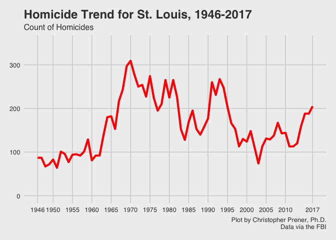
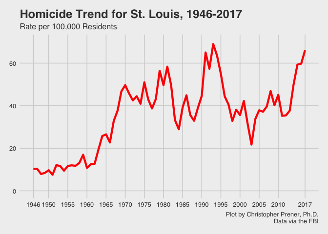
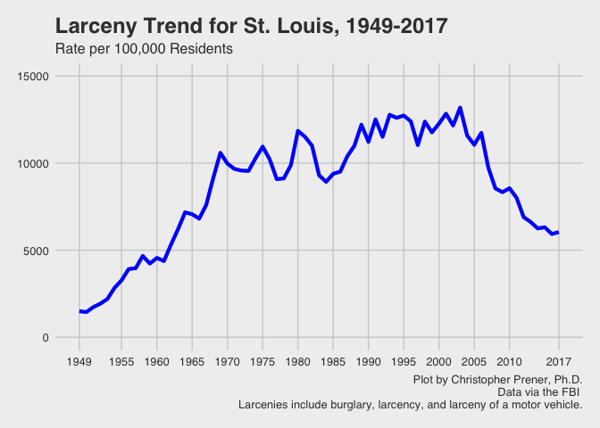

Assignment Name
================
Your Name
(January 31, 2019)

## Introduction

This notebook creates plots of homicide rates, violent crime rates, and
larceny rates.

## Dependencies

This notebook requires a number of plotting packages:

``` r
# tidyverse packages
library(dplyr)
```

    ## 
    ## Attaching package: 'dplyr'

    ## The following objects are masked from 'package:stats':
    ## 
    ##     filter, lag

    ## The following objects are masked from 'package:base':
    ## 
    ##     intersect, setdiff, setequal, union

``` r
library(ggplot2)
library(readr)

# other packages
library(ggthemes)
library(here)
```

    ## here() starts at /Users/chris/GitHub/Personal/STL_CRIME_Trends

## Load Data

This notebook requires the previously created crime trends data:

## Plots

### Homicide Count

``` r
yearBreaks <- c(1946, 1950, 1955, 1960, 1965, 1970, 1975, 1980, 1985, 
                1990, 1995, 2000, 2005, 2010, 2017)

plot <- stLouis %>%
  ggplot(aes(x = year, y = murder)) +
    geom_line(color = "#ff0000", size = 1.5) + 
    scale_y_continuous(limits = c(0, 350)) +
    scale_x_continuous(breaks = yearBreaks) +
    labs(title = "Homicide Trend for St. Louis, 1946-2017", 
         subtitle = "Count of Homicides",
         caption = "Plot by Christopher Prener, Ph.D.\nData via the FBI") +
  theme_fivethirtyeight()

ggsave(here("results", "homicide_count.png"), plot,
       width = 6.5, height = 4.75, units = "in")

plot
```

<!-- -->

### Homicide Rate

``` r
yearBreaks <- c(1946, 1950, 1955, 1960, 1965, 1970, 1975, 1980, 1985, 
                1990, 1995, 2000, 2005, 2010, 2017)

plot <- stLouis %>%
  ggplot(aes(x = year, y = murderRate)) +
    geom_line(color = "#ff0000", size = 1.5) + 
    scale_y_continuous(limits = c(0, 70)) +
    scale_x_continuous(breaks = yearBreaks) +
    labs(title = "Homicide Trend for St. Louis, 1946-2017", 
         subtitle = "Rate per 100,000 Residents",
         caption = "Plot by Christopher Prener, Ph.D.\nData via the FBI") +
  theme_fivethirtyeight()

ggsave(here("results", "homicide_rate.png"), plot,
       width = 6.5, height = 4.75, units = "in")

plot
```

<!-- -->

### Violent Crime Rate

``` r
yearBreaks <- c(1958, 1965, 1970, 1975, 1980, 1985, 
                1990, 1995, 2000, 2005, 2010, 2017)

plot <- stLouis %>%
  filter(year >= 1958) %>%
  ggplot(aes(x = year, y = violentRate)) +
    geom_line(color = "#0000ff", size = 1.5) + 
    scale_y_continuous(limits = c(0, 4000)) +
    scale_x_continuous(breaks = yearBreaks) +
    labs(title = "Violent Crime Trend for St. Louis, 1958-2017", 
         subtitle = "Rate per 100,000 Residents",
         caption = "Plot by Christopher Prener, Ph.D.\nData via the FBI \nViolent crimes include homicide, rape, robbery, and aggrevated assault.") +
    theme_fivethirtyeight()

ggsave(here("results", "violent_rate.png"), plot,
       width = 6.5, height = 4.75, units = "in")

plot
```

<!-- -->

### Larceny Rate

``` r
yearBreaks <- c(1949, 1955, 1960, 1965, 1970, 1975, 1980, 1985, 
                1990, 1995, 2000, 2005, 2010, 2017)

plot <- stLouis %>%
  filter(year >= 1949) %>%
  ggplot(aes(x = year, y = theftRate)) +
    geom_line(color = "#0000ff", size = 1.5) + 
    scale_y_continuous(limits = c(0, 15000)) +
    scale_x_continuous(breaks = yearBreaks) +
    labs(title = "Larceny Trend for St. Louis, 1949-2017", 
         subtitle = "Rate per 100,000 Residents",
         caption = "Plot by Christopher Prener, Ph.D.\nData via the FBI \nLarcenies include burglary, larcency, and larceny of a motor vehicle.") +
    theme_fivethirtyeight()

ggsave(here("results", "larcency_rate.png"), plot,
       width = 6.5, height = 4.75, units = "in")

plot
```

<!-- -->
